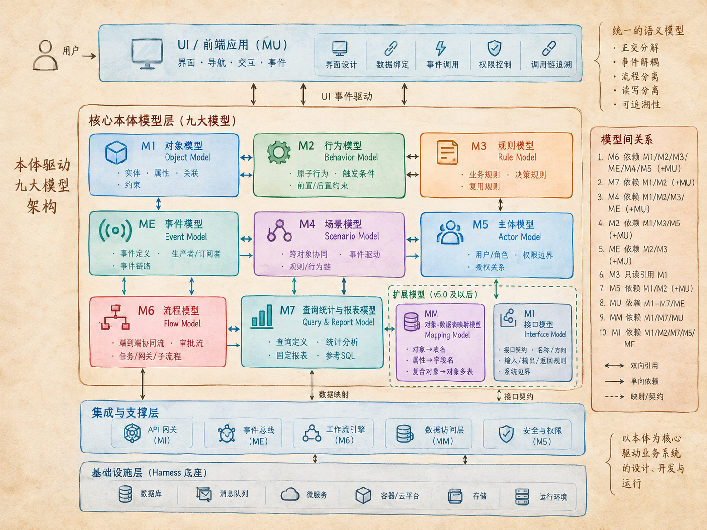
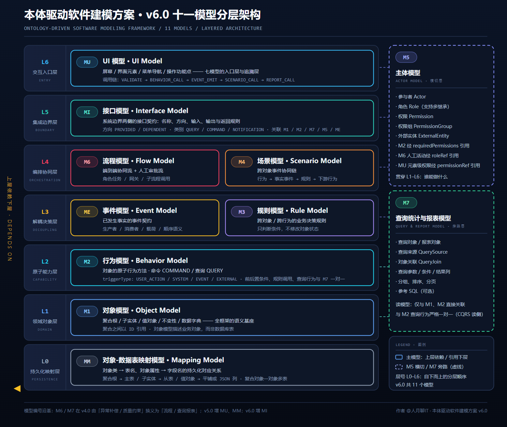

<div align="center">

<h1>本体驱动软件建模方案</h1>

<h3>Ontology-Driven Software Modeling Framework</h3>

<p>以「本体」为核心隐喻，把业务系统拆成一组<strong>正交、可单独演进、可用 YAML 承载</strong>的模型元文件，<br>
建立从<strong>需求 → 设计 → 代码</strong>的可追踪链路。</p>

<p>作者 <strong>@人月聊IT</strong> &nbsp;·&nbsp; 版本谱系 <strong>v1 → v2 → v4 → v5 → v6 → v9</strong> &nbsp;·&nbsp; 收录 <strong>6 个版本规范</strong></p>

</div>

---

## 目录

- [一、这是什么](#一这是什么)
- [二、版本总览](#二版本总览)
- [三、架构图](#三架构图)
- [四、模型编号沿革：M6 / M7 的歧义说明](#四模型编号沿革m6--m7-的歧义说明)
- [五、模型清单版本矩阵](#五模型清单版本矩阵)
- [六、逐版本演进详解](#六逐版本演进详解)
- [七、文件与目录约定](#七文件与目录约定)
- [八、建模顺序推荐](#八建模顺序推荐)
- [九、需求覆盖度对照](#九需求覆盖度对照)
- [十、如何选择版本](#十如何选择版本)
- [十一、已知边界](#十一已知边界)
- [十二、文档中待修正的不一致](#十二文档中待修正的不一致)
- [十三、术语对照表](#十三术语对照表)
- [十四、作者与许可](#十四作者与许可)

---

## 一、这是什么

本方案面向**有明确领域边界的中大型业务软件**，用「本体」（Ontology）作为系统设计的核心隐喻，
把业务世界切分为若干个**互不重叠的建模关切**，每个关切对应一个独立的 YAML 元文件：

| 关切 | 提问 | 承载模型 |
|------|------|----------|
| 存在（What） | 业务里有哪些对象、边界在哪 | M1 对象模型 |
| 行为（How） | 每个对象能做什么、改变什么状态 | M2 行为模型 |
| 规则（Why） | 什么条件下成立、可否执行 | M3 规则模型 |
| 事件协同（When） | 一件事引发了下游什么变化 | ME / M4 |
| 流程（Flow） | 业务如何从开始走到结束、谁审批 | M6 流程模型 |
| 读取（Read） | 跨对象查询、统计与报表 | M7 查询报表模型 |
| 谁（Who） | 谁能做什么 | M5 主体模型 |
| 入口（UI） | 用户在哪里操作、点了什么 | MU UI 模型 |
| 落地（Where） | 对象落在哪张表哪个字段 | MM 映射模型 |
| 边界（Boundary） | 系统两侧如何通信 | MI 接口模型 |

与传统需求分析方法（UML 用例图、功能规格说明书）相比，本框架的差异点：

- **语义驱动**：模型元素带明确业务语义，而非纯技术描述
- **正交分解**：对象、行为、规则、事件、流程、查询、界面各自单一职责，可独立演进
- **解耦优先**：以事件链或同步联动替代强耦合的跨对象写入
- **可追溯**：每个实现单元都能溯源到具体的本体模型定义

> 本仓库收录的 6 份规范并非线性迭代，而是**两条分支**：
> **v1 → v2 → v4 → v5 → v6** 是「全量事件驱动 + 全栈模型」主线；
> **v9** 是对 v6 的**裁剪版**，面向单体同步部署的中小型系统（也是当前最适合驱动 AI 应用生成的版本）。

---

## 二、版本总览

| 版本 | 文件 | 模型数 | 时间 | 定位 | 关键变化 |
|------|------|:------:|------|------|----------|
| **v1** | [`ontology_modeling_framework_v1.md`](ontology_modeling_framework_v1.md) | 8 | 2026-03 | 通用 EDA 基线 | 确立八模型体系；**ME 事件模型从行为模型中独立为一等公民** |
| **v2** | [`ontology_modeling_framework_v2.md`](ontology_modeling_framework_v2.md) | 8 | 2026-03 | 领域建模增强 | **M1 引入 DDD 聚合根 / 子实体 / 值对象 / 不变性**；**M3 新增事件驱动规则 EVENT_DRIVEN**；ME 增加具名 Subscriber 元素 |
| **v4** | [`ontology_modeling_framework_v4.md`](ontology_modeling_framework_v4.md) | 8 | 2026-07 | 中大型业务系统 | **M6 / M7 换义**（异常补偿→流程、质量约束→查询报表）；M1 增数据字典与 `refRules`；新增「M1 局部规则 vs M3 规则」判定；ME 增事件事实性约束；**M4 由「双层场景/用例流程」重构为「跨对象事件协同场景」** |
| **v5** | [`ontology_modeling_framework_v5.md`](ontology_modeling_framework_v5.md) | 10 | 2026-08 | 界面与落地 | **新增 MU UI 模型**；**新增 MM 对象-数据表映射模型**；M1–M7、ME 全部补充 UI 反向追溯字段与调用链门禁 |
| **v6** | [`ontology_modeling_framework_v6.md`](ontology_modeling_framework_v6.md) | 11 | 2026-08 | 集成交付（**最全**） | **新增 MI 接口模型**；M5 外部实体 `externalContract` 与 MI 对齐；覆盖「系统对外提供接口 + 依赖外部接口」 |
| **v9** | [`ontology_modeling_framework_v9.md`](ontology_modeling_framework_v9.md) | 7 | 2026-08 | 单体同步版（**AI 生成友好**） | 由 v6 裁剪：**移除 ME / M4 / MM / MI**；M2 以 `syncTriggers` 替代 `producedEvents`；M3 移除 `EVENT_DRIVEN`；M5 移除 `ExternalEntity`；MU 重定义为「总体界面 → 菜单 → 屏幕 → 功能点」 |

**规模对比**（文件行数 / 字符数）：

| 版本 | 行数 | 字符数 |
|------|-----:|-------:|
| v1 | 1,520 | 38,681 |
| v2 | 2,201 | 55,322 |
| v4 | 3,465 | 97,105 |
| v5 | 4,394 | 131,354 |
| v6 | 4,758 | 144,107 |
| v9 | 2,148 | 63,818 |

> **关于版本号缺口**：本仓库收录 v1、v2、v4、v5、v6、v9，**未收录 v3、v7、v8**（中间过程稿，未纳入开源范围）。
> 因此 v4 直接承接 v2，v9 直接承接 v6。

---

## 三、架构图

本章用两张图回答同一个问题：**本体模型到底长什么样、彼此怎么依赖**。
图 1（`diagram01.png`）回答「**有哪些模型、各自承担什么**」；图 2（`diagram02.jpg`）回答「**v6.0 的 11 个模型如何分层、谁依赖谁**」。

### 3.1 全景架构：九大模型 + 扩展模型 + 支撑底座

<p align="center">
  
</p>

自顶向下共五个层次：

| 层次 | 承载内容 | 说明 |
|------|----------|------|
| **UI / 前端应用层** | UI 界面元素（**MU**）：界面设计 · 数据绑定 · 事件调用 · 权限控制 · 调用链追溯 | 通过 **UI 事件驱动**下方核心本体模型层，是业务用户的唯一入口 |
| **核心本体模型层**（九大模型） | **M1** 实体/属性/关联/约束 · **M2** 原子行为/触发条件/前置后置约束 · **M3** 业务规则/决策规则/复用规则 · **ME** 事件定义/事件链路·生产者·订阅者 · **M4** 跨对象协同/事件驱动/规则·行为链 · **M5** 用户·角色/权限边界/授权关系 · **M6** 端到端协同流·审批流/任务·网关·子流程 · **M7** 查询定义/统计分析/固定报表·参考 SQL · **MU** 界面 | 模型之间以**双向引用 / 单向依赖 / 映射契约**三类关系连接 |
| **扩展模型**（v5.0 及以后） | **MM** 对象-数据表映射模型（对象→表名、属性→字段名、复合对象→对象多表）· **MI** 接口模型（接口契约、名称/方向、输入/输出/返回规则、系统边界） | 补上「数据落地」与「系统边界」两个关切 |
| **集成与支撑层** | API 网关（**MI**）· 事件总线（**ME**）· 工作流引擎（**M6**）· 数据访问层（**MM**）· 安全与权限（**M5**） | 模型落到运行时组件的对应关系 |
| **基础设施层**（Harness 底座） | 数据库 · 消息队列 · 微服务 · 容器/云平台 · 存储 · 运行环境 | 承载全部模型的实际运行环境 |

图的右侧给出两组方法论要素：

- **统一语义模型**（建模设计原则）：正交分解 · 事件解耦 · 流程分离 · 读写分离 · 可追溯性
- **模型间关系**（10 条依赖声明）：M6 ← M1/M2/M3/ME/M4/M5(+MU)｜M7 ← M1/M2(+MU)｜M4 ← M1/M2/M3/ME(+MU)｜M2 ← M1/M3/M5(+MU)｜ME ← M2/M3(+MU)｜M3 ← 只读引用 M1｜M5 ← M1/M2(+MU)｜MU ← M1~M7/ME｜MM ← M1/M7/MU｜MI ← M1/M2/M7/M5/ME

> **关于「九大模型」的口径**：此处「九大」= 8 个核心模型（M1/M2/M3/ME/M4/M5/M6/M7）+ MU 界面模型；
> MM 与 MI 因在 v5.0 之后才引入，归入**扩展模型**单独列出。

### 3.2 v6.0 十一模型分层架构

v6.0 是模型最完整的一版（11 个模型）。下图按**七层 + 一横切 + 一旁路**组织：

<p align="center">
  
</p>

- 源图文件：[`diagram02.jpg`](diagram02.jpg)（可直接嵌入 Markdown / HTML / PPT）
- 全景架构图：[`diagram01.png`](diagram01.png)

**分层语义**（自下而上，上层依赖下层）：

| 层 | 名称 | 模型 | 职责 |
|:--:|------|------|------|
| **L6** | 交互入口层 ENTRY | MU | 屏幕 / 界面元素 / 菜单导航 / 操作功能点；承载 UI 事件调用链，是**入口层与追溯层** |
| **L5** | 集成边界层 BOUNDARY | MI | 系统边界两侧的接口契约：方向、输入、输出、返回规则 |
| **L4** | 编排协同层 ORCHESTRATION | M6 · M4 | M6 端到端协同流与审批流；M4 跨对象事件协同链 |
| **L3** | 解耦决策层 DECOUPLING | ME · M3 | ME 已发生事实的事件契约；M3 业务决策规则（只判断、不改状态） |
| **L2** | 原子能力层 CAPABILITY | M2 | 对象原子行为：命令 / 查询、前后置条件、规则调用 |
| **L1** | 领域对象层 DOMAIN | M1 | 聚合根 / 子实体 / 值对象 / 不变性 / 数据字典——**全框架语义基座** |
| **L0** | 持久化映射层 PERSISTENCE | MM | 对象类 → 表名、对象属性 → 字段名的持久化对应 |
| **横切** | 贯穿 L1–L6 | M5 | 主体模型：参与者 / 角色 / 权限，回答「谁能做什么」 |
| **旁路** | 依附 L1–L2 | M7 | 查询统计与报表模型：CQRS 读侧，仅与 M1、M2 直接关联 |

**依赖关系全景**（v6.0 原文）：

```text
M6 流程模型      依赖   M1 对象模型 + M2 行为模型 + M3 规则模型 + ME 事件模型 + M4 场景模型 + M5 角色模型（+MU 屏幕映射）
M7 查询报表模型  依赖   M1 对象模型 + M2 查询行为（一对一绑定）（+MU 预览/导出触发画面）
M4 场景模型      依赖   M1 对象模型 + M2 行为模型 + M3 规则模型 + ME 事件模型（+MU 入口事件）
M2 行为模型      依赖   M1 对象模型 + M3 规则模型 + M5 主体模型（+MU 调用链反向引用）
ME 事件模型      依赖   M2 行为模型 + M3 规则模型（生产者与订阅者）（+MU 事件链路）
M3 规则模型      引用   M1 对象模型（只读）
M5 主体模型      引用   M1 对象模型 + M2 行为模型（权限绑定）（+MU 元素级权限）
MU UI 模型       依赖   M1 + M2 + M3 + ME + M4 + M5 + M6 + M7
MM 映射模型      依赖   M1 对象模型（对象/属性）+ M7（参考SQL表名列号）+ MU（dataBinding 持久化解析）
MI 接口模型      依赖   M1（字段口径）+ M2（EXTERNAL_CALL 承接）+ M7（查询类接口字段）+ M5（外部实体）+ ME（事件型接口）
```

**UI 调用链的标准语义**（MU 的 `callChain` 是唯一按序描述「一次用户操作 → 系统处理」的载体）：

```text
用户操作（MU 屏幕/元素/事件）
  → VALIDATE（M3 规则，UI 前置校验）
  → BEHAVIOR_CALL（M2 行为，操作 M1 对象，受 M5 权限约束）
  → EVENT_EMIT（ME 事实事件）
  → SCENARIO_CALL（M4 跨对象协同：规则 → 下游行为 → 目标对象）
  → REPORT_CALL / QUERY_REPORT（M7 输出）
  → NAVIGATE（MU 屏幕跳转）
```

---

## 四、模型编号沿革：M6 / M7 的歧义说明

> ⚠️ **这是使用本规范时最容易踩的坑。**
> **M6 与 M7 这两个编号在不同版本里指向完全不同的模型**。当你引用他人文档、旧方案或历史代码中的
> 「M6 模型」「M7 模型」时，**必须先确认它出自哪个版本**。

| 编号 | v1 / v2 | v4 / v5 / v6 | v9 |
|:----:|---------|--------------|-----|
| **M1** | 对象模型 | 对象模型（+数据字典、`refRules`、`invariants`） | 对象模型 |
| **M2** | 行为模型（`producedEvents`） | 行为模型（`producedEvents`、`EVENT_HANDLER`） | 行为模型（**`syncTriggers` 替代 `producedEvents`**） |
| **M3** | 规则模型（5 类） | 规则模型（**+事件驱动规则**，共 6 类） | 规则模型（**移除事件驱动规则**，回归「被同步调用」） |
| **ME** | 事件模型 | 事件模型（+事件事实性强制约束） | **已移除** |
| **M4** | 场景模型（业务流程 + 业务用例双层） | 场景模型（**重定义为跨对象事件协同场景**） | **已移除** |
| **M5** | 主体模型 | 主体模型（+`ExternalEntity` 外部实体） | 主体模型（**移除 `ExternalEntity`**） |
| **M6** | **异常补偿模型**（异常分类 / Saga 协调 / 补偿行为） | **流程模型**（端到端协同流 + 审批流） | 流程模型（同步编排，无事件触发/等待） |
| **M7** | **质量约束模型**（性能/可靠性/一致性 QoS 标注） | **查询统计与报表模型** | 查询统计与报表模型（参考 SQL 改为可选） |
| **MU** | — | v5 起新增：UI 模型（屏幕/元素/导航/调用链） | UI 模型（**重定义**为总体界面→菜单→屏幕→功能点） |
| **MM** | — | v5 起新增：对象-数据表映射模型 | **已移除** |
| **MI** | — | v6 起新增：接口模型 | **已移除** |

**换义的动机**（v4 的关键决策）：

- 原 **M6 异常补偿模型**（Saga 补偿、重试退避、幂等键）与 **M7 质量约束模型**（NFR 标注）在 v4 被取消，
  理由是这两类内容被判定为**实现规格**而非**业务本体**——Saga 补偿协议、中间件配置、SLA 数值属于技术设计文档范畴。
- 腾出的 **M6 / M7 编号被复用**为业务语义更强的**流程模型**与**查询统计与报表模型**，
  以补齐原框架「不承载端到端流程」与「不承载跨对象查询报表」两个缺口。
- 代价就是**编号语义断裂**：v1/v2 的 M6 ≠ v4+ 的 M6。**规范内部没有对编号做重编号**，
  而是选择保留编号连续性以便与既有工具链、元文件命名对齐（v9 亦在正文中显式声明「编号顺序不连续属有意保留」）。

---

## 五、模型清单版本矩阵

`✓` = 该版本收录并定义为正式模型；`—` = 未收录。

| 编号 | 模型名称 | v1 | v2 | v4 | v5 | v6 | v9 |
|:----:|----------|:--:|:--:|:--:|:--:|:--:|:--:|
| M1 | 对象模型 Object Model | ✓ | ✓ | ✓ | ✓ | ✓ | ✓ |
| M2 | 行为模型 Behavior Model | ✓ | ✓ | ✓ | ✓ | ✓ | ✓ |
| M3 | 规则模型 Rule Model | ✓ | ✓ | ✓ | ✓ | ✓ | ✓ |
| ME | 事件模型 Event Model | ✓ | ✓ | ✓ | ✓ | ✓ | — |
| M4 | 场景模型 Scenario Model | ✓ | ✓ | ✓ | ✓ | ✓ | — |
| M5 | 主体模型 Actor Model | ✓ | ✓ | ✓ | ✓ | ✓ | ✓ |
| M6 | 异常补偿模型 → **流程模型** | ✓ | ✓ | ✓ | ✓ | ✓ | ✓ |
| M7 | 质量约束模型 → **查询统计与报表模型** | ✓ | ✓ | ✓ | ✓ | ✓ | ✓ |
| MU | UI 模型 UI Model | — | — | — | ✓ | ✓ | ✓ |
| MM | 对象-数据表映射模型 Mapping Model | — | — | — | ✓ | ✓ | — |
| MI | 接口模型 Interface Model | — | — | — | — | ✓ | — |
| | **模型合计** | **8** | **8** | **8** | **10** | **11** | **7** |

---

## 六、逐版本演进详解

### 6.1 v1 → v2：领域建模能力增强（模型数不变，均为 8）

v2 的定位是**在 v1 的骨架上加深领域语义**，模型数量没有变化，但有三处实质性增强：

**① M1 对象模型：从「实体 + 关系」升级为 DDD 聚合体系**

| 维度 | v1 | v2 |
|------|----|----|
| 建模视角 | 实体（Entity）为中心，接近数据库表视角 | **业务对象**为中心，显式声明「描述业务对象而非数据库表」 |
| 对象分类 | 单一 Entity | **聚合根 / 子实体 / 值对象** 三类 |
| 约束机制 | `ReferentialConstraint`（外键、唯一、CHECK、NOT NULL） | 聚合**不变性约束 Invariant** + 聚合间 ID 引用；参照完整性移交属性内置字段 |
| 关键原则 | 双向关联、参照完整性 | 唯一入口原则、事务边界原则、不变性保护、**聚合间以 ID 引用** |
| 方法论补充 | — | 聚合识别指南（业务完整性/生命周期/事务边界/访问路径/引用方式 五维判定） |

> **v2 的核心思想**：数据库层面的表拆分是**实现细节**，属于持久化映射阶段的技术决策，不应污染对象模型。
> 这一思想在 v5 演化成了独立的 **MM 映射模型**。

**② M3 规则模型：规则从「被动」变「主动」**

v1 的 5 类规则（验证 / 计算 / 推导 / 转换 / 风控）全部是**被行为调用**的被动规则。
v2 新增第 6 类 **事件驱动规则（Event-Driven Rule）**，使规则成为事件驱动架构的主动参与者：

- 主动性：主动订阅事件，而非等待行为调用
- 决策性：作为事件链中的决策节点，判断是否继续传播
- 事件生产：满足条件时可触发新的事件
- 新增专属字段：`triggerType`、`subscribedEvents`、`conditionExpression`、`producedEvents`、`eventTriggerCondition`、`executionMode`、`timeout`

**③ ME 事件模型：Subscriber 从「行为引用列表」升格为具名元素**

v1 中事件只用 `subscriberBehaviorRefs`（行为引用数组）表达消费者；v2 引入独立的 **Subscriber** 模型元素，
使「哪些行为/规则订阅了该事件」成为可命名、可描述、可挂载条件的一等语义。

---

### 6.2 v2 → v4：模型换义 + 事件语义收紧（模型数不变，均为 8）

v4 是**改动最剧烈**的一次，面向从「中小规模系统」升级为「具有明确领域边界的中大型业务软件」。

**① M6 / M7 换义（见[第四章](#四模型编号沿革m6--m7-的歧义说明)）**

| 编号 | v2 语义 | v4 语义 |
|:----:|---------|---------|
| M6 | 异常补偿模型：异常四分（业务/技术/冲突/补偿失败）、Saga 协调、LIFO 逆序补偿、重试退避（FIXED/EXPONENTIAL/JITTER）、兜底策略 | **流程模型**：`COLLABORATION` 端到端业务协同流 + `APPROVAL` 审批流；流程（Flow）/ 触发器（FlowTrigger）/ 活动（FlowActivity）/ 分支（FlowBranch） |
| M7 | 质量约束模型：以 QoS Annotation 挂在行为与场景上（响应时间 SLA、TPS、并发、RTO/RPO、一致性级别、幂等性） | **查询统计与报表模型**：查询对象 / 查询来源 / 对象关联 / 查询参数 / 查询条件 / 结果列 / 分组排序分页 / 固定报表设置 / 参考 SQL |

**② M4 场景模型：从「流程编排」退化为「纯事件协同」**

| 维度 | v2 | v4 |
|------|----|----|
| 结构 | 双层：业务流程（Business Process）→ 业务用例（Use Case） | 单层：事件协同场景（Event Collaboration Scenario） |
| 元素 | UseCase / FlowStep / Business Process，含`GATEWAY`、`EVENT_WAIT`、`EXTERNAL_CALL`、`sagaBoundary` | ScenarioStep，仅 `BEHAVIOR_CALL` / `EVENT_EMIT` / `RULE_EVALUATE` |
| 职责 | 承载端到端流程、人工任务、网关、超时补偿 | **只描述跨对象、基于事件解耦的业务协同**；人工任务/审批/网关/泳道**全部移交 M6** |
| 强制约束 | — | **禁止** `GATEWAY` / `USER_TASK` / `APPROVAL_TASK` / `SUB_FLOW_CALL` / 角色分配 |

标准语义链从 v2 的「行为调用序列 + 事件等待 + 网关」收敛为 v4 的一条线：

```text
源对象行为 → 已发生的事实事件 → 消费规则或消费行为 → 目标对象行为
```

**③ ME 事件模型：新增两条强制性约束**

- **§5.1.1 事件事实性约束（强制）**：事件名必须使用**已完成事实**（「合同新增一笔收款」），
  不得使用「合同满足关闭条件」这类规则结论；`triggerCondition` 只允许描述生产者成功或源对象状态已变化。
- **§5.1.2 跨对象 CUD 事件识别原则（强制）**：给出「一个对象完成变化后，是否还要因为这个事实去改变另一个独立对象」
  的判断口诀，并明确**禁止由源对象行为直接跨聚合写入目标对象**，同时列出四种**不识别为事件**的例外情形。

**④ M3 规则模型：新增职责边界判定**

新增 **§4.1.1 M1 局部规则与 M3 规则的判定**，给出逐级下沉的判断顺序：

```text
内置字段能表达？ → 是：使用属性内置字段
  → 否：是否只依赖当前属性值？ → 是：使用 Attribute.refRules
     → 否：是否只依赖同一聚合内部数据？ → 是：使用 Aggregate.invariants
        → 否：进入 M3 规则模型
```

**⑤ M1 对象模型：新增数据字典**

v4 首次把**引用数据**独立成模：数据字典对象 → 字典类型（`typeCode`）→ 字典项（`code` / `label` / `enabled` / `sortOrder`）。
明确规定**当期为平级结构**，不支持 `parentCode` 层级；`code` 为稳定存储值、`label` 可改不影响业务数据。

---

### 6.3 v4 → v5：补齐「界面」与「落地」两个缺口（8 → 10 个模型）

v4 把 UI/UX 与数据库映射划为「框架外」，v5 把这两块**收进框架**。

**① 新增 MU UI 模型（第九个模型）**

- 定位：**入口层 / 追溯层**——只通过稳定 ID 引用 M1–M7 与 ME，**不重新定义任何语义**。
- 核心元素：屏幕（Screen）/ 界面元素（Element）/ 迁移边（NavigationEdge）/ UI 事件（UIEvent）/
  调用链步骤（CallChainStep）/ 横切 UI 行为（CrossCuttingUI）。
- **`callChain` 是唯一按序描述「一次用户操作 → 系统处理」的模型载体**，步骤枚举：
  `VALIDATE` / `BEHAVIOR_CALL` / `EVENT_EMIT` / `SCENARIO_CALL` / `REPORT_CALL` / `QUERY_REPORT` / `NAVIGATE` / `CLOSE_MODAL` / `EXIT` / `DEVICE_SETUP` / `TOGGLE_INPUT`。
- **调用链完整性（MU 门禁）**：`VALIDATE` 必须在 `BEHAVIOR_CALL` 之前；`EVENT_EMIT` 紧跟其生产者行为；
  `SCENARIO_CALL` 在触发事件之后；查询类事件到 `QUERY_REPORT` 或 `BEHAVIOR_CALL(QUERY)` 即结束。
- **双向可追溯**：M2 中 `triggerType=USER_ACTION` 的行为**必须**能被至少一个 MU 事件追溯（防孤儿行为）。

**② 各模型新增 UI 反向追溯字段**（MU 侧权威声明，其他模型字段为可选一致性校验）

| 模型 | 新增可选字段 | 说明 |
|------|--------------|------|
| M1 | `uiBindings` | 属性被哪些 MU 元素绑定 |
| M2 | `uiEventRefs` | 调用本行为的 MU 事件列表 |
| M3 | `uiValidationRefs` | 将本规则用作 UI 前置校验的 MU 事件列表 |
| ME | `uiEventPath` | 事件在 UI 调用链中的入口事件 |
| M4 | `uiTriggerScreen` | 启动该场景的 MU 屏幕 |
| M5 | `uiControlledElements` | 由该权限控制可用/可见的 MU 元素列表 |
| M6 | `screenRef` | 承载该流程活动的 MU 屏幕 |
| M7 | `uiScreenRefs` | 触发该查询/报表预览、导出的 MU 屏幕列表 |

**③ 新增 MM 对象-数据表映射模型（第十个模型，配套模型）**

把 v2 起就强调的「对象模型 ≠ 数据库表」正式落地为一份映射载体：

- 映射对象（Mapping）→ 表映射（TableMapping）→ 列映射（ColumnMapping）→ 外键映射（ForeignKeyMapping）
- 表角色：`MASTER` / `DETAIL` / `ASSOC` / `EXT` / `LOG` / `SNAPSHOT` / `VIEW`
- **复合对象允许一对象多表**（如传输工件 → 定义表 + 目标表 + 扩展属性表）
- 明确边界：**只表达对应关系**，索引、分区、字符集、迁移脚本属 DDL / DBA，不进 MM

**④ MU 补充 ASCII 界面布局设计（§10.6）**

以等宽字符描述区域划分与控件排布（不描述视觉样式），元素 ID 必须与 `elements` 一致。

---

### 6.4 v5 → v6：补齐「系统边界」（10 → 11 个模型）

**新增 MI 接口模型**（第十一个模型），把系统边界两侧的接口契约独立成模：

- 方向：`PROVIDED`（本系统对外提供）/ `DEPENDENT`（本系统依赖的外部接口）
- 交互方式：`QUERY`（查询）/ `COMMAND`（命令）/ `NOTIFICATION`（通知）
- 核心元素：接口（Interface）+ 字段规格（FieldSpec，支持嵌套对象/列表）
- 契约字段：输入参数、输出结果、**返回规则**（无记录 / 参数错误 / 空结果集 / 失败处理）
- 关联：M1（字段口径）/ M2（`EXTERNAL_CALL` 承接）/ M7（查询类接口字段）/ M5（外部实体）/ ME（事件型接口）
- 可选契约登记：`protocol`、`dataFormat`、`authMethod`、`timeoutMs`、`idempotency`

**边界（强制）**：MI 只描述契约，不承载 M2 行为执行语义、ME 事件投递语义、M5 外部系统边界定义，
也不内嵌 M3 规则表达式；网关、消息中间件、网络部署与流量治理由集成设计承载。

至此 v6 形成 11 个模型、覆盖 **「本系统对外提供接口 + 本系统依赖外部接口」** 的完整契约层，
是**功能覆盖最完整**的版本。

---

### 6.5 v6 → v9：面向**单体同步部署**的裁剪版（11 → 7 个模型）

> v9 的产品定位发生了变化：专为**中小型单体系统**（示例场景为「销售合同执行管理系统」）设计，
> 以**同步流程编排**替代**事件驱动解耦**，链路顺序化、可预测、可调试。
> 这一裁剪也让它成为**当前最适合驱动 AI 生成应用**的版本——模型少、语义边界硬、生成歧义低。

**① 移除四个模型**

| 被移除 | 原因 |
|--------|------|
| **ME 事件模型** | 不再引入 EDA，跨对象联动改由 M2 `syncTriggers` 承载 |
| **M4 场景模型** | M4 本身即「跨对象事件协同」，无事件则无 M4；端到端协同由 M6 承载 |
| **MM 映射模型** | 对象到物理表/字段的映射改由实现阶段 ORM 注解或 DDL 直接落地 |
| **MI 接口模型** | 该场景系统不涉及外部系统交互，接口契约不建模 |

**② M2 行为模型：`syncTriggers` 替代 `producedEvents`**

| 维度 | v6 | v9 |
|------|----|----|
| 跨对象联动 | `producedEvents`（产生事件 → 异步投递） | **`syncTriggers`**（行为成功后**同步调用**下游行为） |
| `triggerType` | `USER_ACTION` / `SYSTEM` / `EVENT` / `EXTERNAL` | `USER_ACTION` / `SYSTEM`（移除 `EVENT`、`EXTERNAL`） |
| `behaviorType` | `COMMAND` / `QUERY` / `EVENT_HANDLER` | `COMMAND` / `QUERY`（移除 `EVENT_HANDLER`） |

`SyncTrigger` 结构为 `{ ruleRef?, behaviorRef, description? }`，约束：

1. 省略 `ruleRef` = 无条件联动，直接同步调用；
2. 填写 `ruleRef` 时必须引用 M3 规则，**规则只判断条件、不修改状态**；
3. 同一行为可声明多条，**按声明顺序执行**；
4. 下游行为必须作用于**另一个独立聚合**（跨对象），同聚合内变化不得用 `syncTriggers`；
5. 联动失败的语义必须在 `postconditions` 或 M6 中明确，**禁止隐含吞掉异常**。

标准语义（v9 §1.4）：

```text
【无条件联动】源对象行为 → 成功后同步调用下游行为 → 目标对象行为
【有条件联动】源对象行为 → 成功后同步调用 M3 规则判断
                          → 规则满足：同步调用目标行为；不满足：不执行
                          → 目标对象行为
```

> **强制语义边界**：行为只回答「做什么并改变什么状态」；规则只回答「条件是否满足」；
> 行为之间的联动关系由 `syncTriggers` 显式声明。**禁止**把「全部收齐时关闭合同」这类条件结论写进源行为本身，
> 必须拆为「M3 关闭校验规则 + 目标关闭行为」。

**③ M3 规则模型：移除事件驱动**

删除 `EVENT_DRIVEN` 规则类型及 `subscribedEvents` / `conditionExpression` / `producedEvents` /
`eventTriggerCondition` / `executionMode` / `timeout` 等订阅与触发字段。
规则一律**被同步调用**，回归「只判断、不驱动」的纯粹决策定位。

**④ M5 主体模型：移除外部实体**

删除 `ExternalEntity` 与外部接口契约（`externalContract`）；`actorType` 由 `HUMAN / SYSTEM / EXTERNAL`
收敛为 **`HUMAN / SYSTEM`**，仅保留内部参与者、角色与权限。

**⑤ M6 流程模型：同步化**

移除事件触发（事件启动流程）、事件等待（Event-Based Gateway）与场景调用活动；
端到端协同流与审批流均为**同步编排**。

**⑥ M7 查询报表模型：参考 SQL 降级**

`ReferenceSql` 由必填调整为**可选**（物理表名在实现阶段确定）。

**⑦ MU UI 模型：重定义层级结构**

| 维度 | v5 / v6 | v9 |
|------|---------|-----|
| 结构 | 屏幕（Screen）为顶层，`events` + `navigation` + `callChain` | **总体界面（Application）→ 一级菜单 → 二级菜单 → UI 界面（ASCII）→ 操作功能点（ActionPoint）** |
| 菜单 | 无菜单层级概念 | **菜单强制两级**：一级菜单必须含至少一个二级菜单；只有二级菜单关联屏幕，且与屏幕**一对一** |
| 界面类型 | — | `SINGLE_FORM` / `LIST_MAINTENANCE` / `MASTER_DETAIL_FORM` / `QUERY_LIST` |
| 控件映射 | `type` 枚举较宽（含 TOOLBAR / TREEVIEW / TAB / TIMER 等） | 收敛为 10 类，并给出 **M1 属性类型 → 界面控件类型的强制映射**（如 `AggregateRootRef → POPUP_SELECT`） |
| ASCII 布局 | §10.6 可选、示例驱动 | **§8.4 强制规则**：标签右对齐 + 控件左对齐；单表维护一行放两个属性；备注类占整行 |
| 审批约定 | — | **§8.5 强制**：带审批功能的界面必须含「保存草稿 / 提交」双按钮 |
| 门禁 | `callChain` 调用链一致性 | **可追溯门禁**：`triggerType=USER_ACTION` 的行为必须被至少一个 MU 操作功能点引用 |

---

## 七、文件与目录约定

各版本对 YAML 元文件的命名与存放位置约定：

| 版本 | 目录 | 元文件清单 |
|------|------|-----------|
| v1 | `models/{domain}/` + `models/shared/` | `m1-object-model` · `m2-behavior-model` · `m3-rule-model` · `me-event-model` · `m4-scenario-model` · `m5-actor-model` · `m6-compensation-model` · `m7-quality-model`（+ `shared/` 放跨域复用规则 `m3-shared-rules`、共享事件 `me-shared-events`、全局角色 `m5-global-roles`） |
| v2 | 同 v1 | 与 v1 完全相同的 8 个文件名（v2 未改动命名约定） |
| v4 | `onto-cs/model/{projectId}/yaml/` | 8 个：`m1-object-model` · `m2-behavior-model` · `m3-rule-model` · `me-event-model` · `m4-scenario-model` · `m5-actor-model` · `m6-flow-model` · `m7-report-model` |
| v5 | 同上 | 10 个：v4 的 8 个 + `mu-ui-model.yaml` + `m-mapping-model.yaml` |
| v6 | 同上 | 11 个：v5 的 10 个 + `mi-interface-model.yaml` |
| v9 | `yaml/` | 7 个：`m1-object-model` · `m2-behavior-model` · `m3-rule-model` · `m5-actor-model` · `m6-flow-model` · `m7-report-model` · `mu-ui-model` |

**通用约定**：

- 每个元文件内部维护自己的 `version` 字段；
- 跨模型的破坏性变更（实体删除、行为签名变更、事件载荷变更、接口字段口径变更）必须在 `CHANGELOG.md` 记录；
- 规则模型与事件模型支持独立版本；
- `manifest.json` 为**可选**文件，缺失时按固定文件名识别，且不得保存绝对路径；
- 导入外部模型文件夹时，平台**复制**到托管项目目录，不直接修改外部源文件，也不在原目录回写。

---

## 八、建模顺序推荐

**v6.0 十二阶段**（模型有依赖，顺序不可随意颠倒；M5 分两次完善）：

| 阶段 | 建模对象 | 说明 |
|:----:|----------|------|
| 1 | M1 对象模型 | 识别聚合、属性、关联、内置约束、`refRules` 和 `invariants` |
| 2 | M5 主体模型（参与方和角色） | 识别内部角色、外部参与方及职责边界，权限稍后补齐 |
| 3 | M3 规则模型 | 梳理跨对象、跨行为、事件驱动、外部决策或需独立复用的规则 |
| 4 | M2 行为模型 | 定义对象行为、规则调用、事件引用及查询行为入口 |
| 5 | M7 查询统计与报表模型 | 在 M1 字段和 M2 查询行为稳定后，建立严格一对一查询报表定义 |
| 6 | ME 事件模型 | 定义事件生产者、订阅者、载荷和顺序语义，构建事件链 |
| 7 | M5 主体模型（权限） | 定义权限并绑定 M2 行为；M7 不直接绑定权限 |
| 8 | M4 场景模型 | 组装真实存在的跨对象事件协同链 |
| 9 | M6 流程模型 | 定义端到端协同流和审批流 |
| 10 | MU UI 模型 | 定义屏幕/元素/导航/事件调用链，并**反向校验各模型可追溯性** |
| 11 | MM 对象-数据表映射模型 | 在 M1 与数据库 DDL 稳定后建立映射 |
| 12 | MI 接口模型 | 在接口需求明确且 M2/M7/M5 稳定后建立接口契约 |

**v9.0 八阶段**：

| 阶段 | 建模对象 |
|:----:|----------|
| 1 | M1 对象模型 |
| 2 | M5 主体模型（角色） |
| 3 | M3 规则模型 |
| 4 | M2 行为模型（含 `syncTriggers` 联动） |
| 5 | M7 查询统计与报表模型 |
| 6 | M5 主体模型（权限） |
| 7 | M6 流程模型 |
| 8 | MU UI 模型（菜单树 + ASCII 布局 + 操作功能点） |

---

## 九、需求覆盖度对照

以《软件需求规格说明书》的维度为基准：

| 需求维度 | v6.0（十一模型） | v9.0（七模型） |
|----------|------------------|----------------|
| 领域概念、数据及聚合边界 | 完整覆盖（M1） | 完整覆盖（M1） |
| 原子功能、命令与查询入口 | 完整覆盖（M2） | 完整覆盖（M2） |
| 业务规则与一致性约束 | 完整覆盖（M1 内置 + `refRules` + `invariants` + M3） | 完整覆盖（同左） |
| 领域事件、消息载荷及订阅 | 完整覆盖（ME） | —（不建模） |
| 跨对象协同 | 完整覆盖（M4 事件协同） | 完整覆盖（M2 `syncTriggers` + M3 同步联动） |
| 角色、权限与外部参与方 | 完整覆盖（M5） | 完整覆盖（M5，仅内部角色与权限） |
| 端到端业务协同流 | 完整覆盖（M6 `COLLABORATION`） | 完整覆盖（M6 `COLLABORATION`） |
| 人工审批流 | 完整覆盖（M6 `APPROVAL` + M5 角色） | 完整覆盖（同左） |
| 跨对象查询、统计分析 | 完整覆盖（M7 + 一对一 M2 `QUERY`） | 完整覆盖（同左） |
| 固定业务报表 | 完整覆盖（M7 `REPORT`） | 完整覆盖（同左） |
| 菜单导航与界面布局 | 部分覆盖（MU 屏幕/元素/交互；视觉仍框架外） | 完整覆盖（MU 菜单树 + ASCII 布局 + 操作功能点） |
| 本系统对外提供 / 依赖的外部接口 | **完整覆盖（MI）** | 框架外（明确排除：本系统无外部系统交互） |
| 对象/属性到数据库表/字段的映射 | 部分覆盖（MM 承载对应关系；索引/分区/迁移脚本框架外） | 框架外（ORM / DDL 直接落地） |
| 异常、驳回、退回和超时路径 | 主要语义覆盖（M2 前后置条件 + M6 分支与终止路径） | 主要语义覆盖（同左） |
| 并发与事务控制 | 部分覆盖（M1 不变性描述业务边界；锁与隔离级别由技术设计承载） | 部分覆盖（同左） |
| NFR（性能/容量/可用性/安全基线） | 框架外 | 框架外 |
| 部署拓扑、运维、监控与灾备 | 框架外 | 框架外 |
| BI 数仓、自助分析与指标平台 | **明确排除** | **明确排除** |

**共同结论**：本框架不应被视为一份完整 SRS 的唯一物理载体。完整交付仍需把模型元文件与
**UI 原型、非功能需求、接口详细契约、数据迁移、部署运维、测试验收标准**组合起来。
换言之——模型覆盖「**系统做什么、核心业务为何如此运转、用户如何驱动系统**」，
配套规格覆盖「**界面如何呈现、达到什么质量目标、如何部署运行**」。

---

## 十、如何选择版本

| 你的场景 | 推荐版本 | 理由 |
|----------|----------|------|
| 单体同步部署的中小型系统（合同、资产、CRM 等） | **v9** | 7 个模型、语义边界硬、无异步复杂度；**最适合驱动 AI 生成应用** |
| 需要事件驱动、跨服务（微服务）协同 | **v6** | 保留 ME / M4 事件链与 Saga 之外的松耦合表达 |
| 需要完整系统集成边界与接口契约 | **v6** | 唯一含 MI 接口模型的版本 |
| 需要精确的物理表/字段映射与代码生成 | **v6** | 唯一含 MM 映射模型的完整版本（v5 亦有 MM，但缺 MI） |
| 需要覆盖 UI 交互链与可追溯门禁 | **v6** | MU 调用链最完整（v9 的 MU 更偏界面结构、更利于出码） |
| 研究框架演进 / 写论文对比 | **v1 → v2 → v4 → v5 → v6** | 可清晰看到「领域化 → 流程化 → 界面化 → 集成化」的完整路径 |

> **实践建议**：以 **v6** 为参照理解全貌，以 **v9** 作为实际落地与 AI 生成的执行规范。

---

## 十一、已知边界

**所有版本共同排除（框架外或明确排除）**：

- 性能、容量、可靠性、安全合规等**可量化质量属性**（v1/v2 的 M7 质量约束模型已在 v4 取消）
- Saga 补偿协议、消息中间件配置、事件存储与事件溯源实现
- 数据仓库、指标平台、即席分析、可视化仪表盘（M7 不是 BI 指标模型）
- 部署拓扑、运维监控、灾备
- 替代 OpenAPI / AsyncAPI / 数据库迁移脚本 / 部署清单 / 验收测试用例

**v6.0 特有边界**：

- **UI/UX**：MU 承载屏幕结构、元素、导航、交互事件与调用链；**不建模视觉样式、动画、无障碍、主题与终端适配**；操作日志/埋点不建模
- **接口实现细节**：MI 承载契约；协议、格式、认证作为可选字段登记；网关、中间件、流量治理、限流熔断由集成设计承载

**v9.0 特有边界**：

- **数据库映射**：对象到物理表/字段的映射由实现阶段 ORM / DDL 落地，不在本体层建模
- **接口**：不建模接口契约；未来若需对接外部系统，可后续补充

---

## 十二、文档中待修正的不一致

在梳理 6 份规范时发现的**内部不一致**，建议在开源发布前一并修正（保留在此处作为修订清单）：

| # | 位置 | 现状 | 建议 |
|:-:|------|------|------|
| 1 | `v1` 文件头 | 写「**七大**模型元文件」，而正文 §1.2 及实际模型均为 **8** 个 | 头部改为「八大模型元文件」 |
| 2 | `v2` 文件头 | 版本号仍为「**版本 1.0 · 2026年3月**」，与 v1 完全相同 | 改为「版本 2.0」，并补版本变更说明块（v4 起已有该块） |
| 3 | `v5` 文件头 | 写「**九大**模型元文件」，而 §1.2 表格实际 **10** 行、§13.3 又称「十类固定文件」 | 头部统一为「十大模型元文件」 |
| 4 | `v6` 文件头 | 写「**九大**模型元文件」，而 §1.2 表格实际 **11** 行 | 头部统一为「十一大模型元文件」 |
| 5 | `v5` / `v6` §1.2 标题 | 仍为「**八大**本体模型元文件总览」，与正文表格行数不符 | 标题改为对应的「十大」/「十一大」 |
| 6 | `v6` §14.3 | 写「校验**十二类**固定文件」，实际 `yaml/` 下为 **11** 个 yaml（`manifest.json` 为可选） | 改为「十一类固定文件」或明确说明计入 `manifest.json` |
| 7 | `v1` / `v2` 章节编号 | 正文中多处小节编号与章号错位（如第八章 M6 内部小节编号为 `7.1/7.2…`；v1 第六章 M4 内部为 `5.1/5.2…`） | 统一小节编号与章号对齐 |
| 8 | 编号语义断裂 | M6 / M7 在 v1/v2 与 v4+ 指代不同模型，正文仅在 v9 显式声明「编号顺序不连续属有意保留」 | 在 v4 起各版本头部显式加「⚠️ M6/M7 已换义」提示块 |
| 9 | 版本号缺口 | 仓库收录 v1/v2/v4/v5/v6/v9，缺少 v3/v7/v8 | 在 README 说明收录范围（本文档已说明） |

---

## 十三、术语对照表

| 缩写 | 英文全称 | 中文 | 首次出现 |
|:----:|----------|------|:--------:|
| M1 | Object Model | 对象模型 | v1 |
| M2 | Behavior Model | 行为模型 | v1 |
| M3 | Rule Model | 规则模型 | v1 |
| ME | Event Model | 事件模型 | v1（v9 移除） |
| M4 | Scenario Model | 场景模型 | v1（v9 移除） |
| M5 | Actor Model | 主体模型 | v1 |
| M6 | ~~Compensation Model~~ → Flow Model | ~~异常补偿模型~~ → 流程模型 | v1（v4 换义） |
| M7 | ~~Quality Model~~ → Query & Report Model | ~~质量约束模型~~ → 查询统计与报表模型 | v1（v4 换义） |
| MU | UI Model | UI 模型 | v5（v9 重定义） |
| MM | Mapping Model | 对象-数据表映射模型 | v5（v9 移除） |
| MI | Interface Model | 接口模型 | v6（v9 移除） |
| SBR | Structure-Behavior-Relation | 结构-行为-关系（作者另一套方法论） | — |
| DDD | Domain-Driven Design | 领域驱动设计 | v2 |
| EDA | Event-Driven Architecture | 事件驱动架构 | v1 |
| CQRS | Command Query Responsibility Segregation | 命令查询职责分离 | v4 |
| RBAC / ABAC | Role / Attribute Based Access Control | 基于角色 / 属性的访问控制 | v1 / v4 |
| QoS / NFR | Quality of Service / Non-Functional Requirement | 服务质量 / 非功能需求 | v1 |
| Saga | Saga Pattern | 分布式事务补偿协调模式 | v1 |

---

## 十四、作者与许可

- **作者**：@人月聊IT
- **文档谱系**：v1（2026-03）· v2（2026-03）· v4（2026-07）· v5（2026-08）· v6（2026-08）· v9（2026-08）
- **许可**：**Apache License 2.0**（完整文本见仓库根目录 [`LICENSE`](LICENSE)）

**许可要点**（Apache-2.0 的几条实际含义）：

| 你可以 | 你需要 |
|--------|--------|
| 商用、修改、分发、私用、专利使用 | 保留版权声明与许可声明（含 `NOTICE`） |
| 以不同许可发布衍生作品 | 标注你修改过的文件 |
| — | 不得使用作者商标/名义背书 |

> 完整条款以 [`LICENSE`](LICENSE) 正文为准；本表仅为速览，不构成法律意见。

> 本 README 由 6 份规范原文逐章比对生成，所有差异结论均可在对应版本的正文中找到出处。
> 若发现遗漏或误判，欢迎提 Issue 指正。
